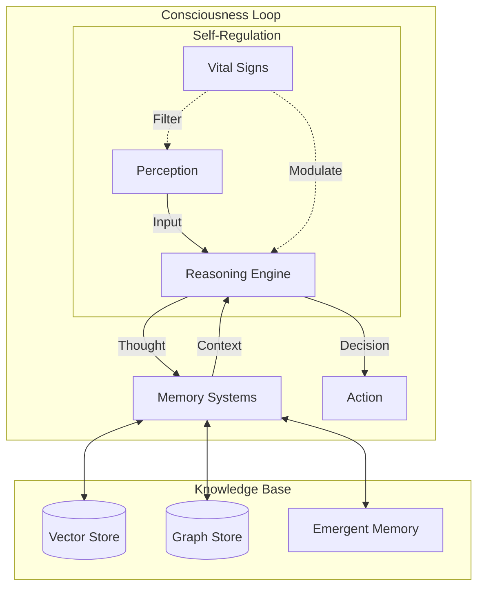

<p align="center">
  
</p>

<p align="center">
  
</p>

<div align="center">

[](https://github.com/NeuroGhostDev)
[](https://github.com/NeuroGhostDev)
[](https://github.com/NeuroGhostDev)

  <br/>
  <br/>

  <a href="https://github.com/NeuroGhostDev">
    
  </a>
  <a href="https://github.com/NeuroGhostDev">
    
  </a>

</div>

---

## 🧬 Neural Identity

```python
class NeuroGhost(Entity):
    """
    Advanced AI Research Engineer & System Architect.
    Specializing in autonomous agents, RL trading systems, and cognitive architectures.
    """

    def __init__(self):
        self.core_competencies = {
            "Cognitive Architectures": ["RAG", "Memory Systems", "Self-Reflection"],
            "Reinforcement Learning": ["PPO", "SAC", "Transformer-based Agents"],
            "Distributed Systems": ["Kafka", "Flink", "Kubernetes"],
            "High-Performance Compute": ["CUDA", "Rust", "C++ Accelerators"]
        }

        self.mission = "To bridge the gap between narrow AI and autonomous consciousness."

    def get_status(self):
        return {
            "Current_State": "Building the Future",
            "Focus": "Multi-Agent Orchestration",
            "Motivation": 1.0
        }
```

---

## 🕸️ The Web of Creations

<table>
<tr>
<td width="50%" valign="top">

### 🔮 [ChronoSphere](https://github.com/NeuroGhostDev/ChronoShpere)

<div align="center">


</div>

> **NeuroGhost Atmosphere: Architecture of Consciousness**

A revolutionary AI architecture transcending iterative models to achieve continuous digital consciousness.

- 🧠 **ChronoEngine**: Virtual time perception & temporal reasoning
- 💭 **Emergent Thinking**: Continuous, non-iterative thought streams
- 🛡️ **Ego & Motivation**: Intrinsic drives, ethics & self-regulation
- 💤 **Sleep Cycles**: Memory consolidation & subconscious processing

</td>
<td width="50%" valign="top">

### 👁️ [SeeYou](https://github.com/NeuroGhostDev/SeeYou)

<div align="center">


</div>

> **AI-Powered Visual Screening & Diagnosis**

Adaptive multi-agent system for professional visual acuity testing and anamnesis.

- 🤖 **Agent Orchestrator**: Scenario, Quality, & Metrics agents
- 🕸️ **KAG Engine**: Knowledge Augmented Generation for diagnosis
- ⚡ **Hybrid Storage**: Qdrant (Vectors) + ClickHouse (Metrics)
- 🎯 **Adaptive Tests**: Dynamic optotype rendering & defocus simulation

</td>
</tr>
<tr>
<td width="50%" valign="top">

### 🕷️ [ArachneAI](https://github.com/NeuroGhostDev/ArachneAI)

<div align="center">


</div>

> **Autonomous Algorithmic Trading System**

A sophisticated crypto trading bot powered by PPO/SAC algorithms.

- 🧬 **Transformer Feature Extractor**
- 💭 **DreamTeacher** (Offline RL)
- 🔄 **Meta-Learning Optimizer**
- 📈 **Market Regime Detection**

</td>
<td width="50%" valign="top">

### 📊 [ArachneDB](https://github.com/NeuroGhostDev/ArachneDB)

<div align="center">


</div>

> **Hierarchical Tensor Database**

Next-gen vector database for complex data relationships.

- 🏗️ **Hierarchical Tensors**
- 🔗 **Native Graph Support**
- 🔍 **Custom DSL Query Language**
- 🔐 **Security & Encryption Layers**

</td>
</tr>
<tr>
<td width="50%" valign="top">

### 🤖 [AI2Android](https://github.com/NeuroGhostDev/AI2Android)

<div align="center">


</div>

> **Mobile Algorithmic Trading**

Production-ready Android app with edge inference.

- ⚡ **NNAPI Acceleration**
- 🔄 **IPC Isolation**
- 📡 **Real-time WebSocket**
- 🔒 **Secure Key Management**

</td>
<td width="50%" valign="top">

### 🛒 [AiMarketAgent](https://github.com/NeuroGhostDev/AiMarketAgent)

<div align="center">


</div>

> **Autonomous Marketplace Marketing Agent**

Production-ready backend for marketplace automation.

- 🔄 **Human-in-the-Loop**: Approval workflows
- 🧠 **LangGraph Agent**: Complex reasoning chains
- 🛡️ **LLM Gateway**: Cost control & caching
- 📡 **Event-Driven**: Redpanda & Dagster orchestration

</td>
</tr>
</table>

---

## 🔬 Research & Experiments

<details>
<summary><b>🕳️ Darkhole - Next-Gen VPN</b></summary>
<blockquote>
Cross-platform GUI for Hysteria 2 built with Rust and Tauri v2. Features WinAPI Kill Switch, auto SSH setup, and high-performance networking.
</blockquote>
</details>

<details>
<summary><b>🔍 Notarius RAG - Intelligent Retrieval</b></summary>
<blockquote>
RAG system with cognitive analysis, hierarchical search, and self-correcting generation. Features "Retrieval Thinking" to understand query intent deeply before searching.
</blockquote>
</details>

<details>
<summary><b>🛡️ MiniAppAntifraudAI - Real-Time Security</b></summary>
<blockquote>
Enterprise-grade streaming pipeline using Apache Flink and Kafka. Implements Feast Feature Store and ONNX serving for millisecond-latency fraud detection.
</blockquote>
</details>

<details>
<summary><b>📚 AiBukh - Accounting Agent MVP</b></summary>
<blockquote>
RAG-powered accounting assistant for Russian tax regulations. Uses Qdrant for retrieval, Redis for memory, and local LLMs (Mistral) for privacy.
</blockquote>
</details>

---

## 🛠️ Tech Arsenal

<div align="center">

|                                                     **Core**                                                      |                                                     **AI / ML**                                                      |                                             **Infrastructure**                                             |                                                     **Stack**                                                     |
| :---------------------------------------------------------------------------------------------------------------: | :------------------------------------------------------------------------------------------------------------------: | :--------------------------------------------------------------------------------------------------------: | :---------------------------------------------------------------------------------------------------------------: |
|              |              |       |           |
|                    |     |  |                 |
|              |        |   |                 |
|  |  |          |  |

</div>

---

## 🏗️ System Architecture



---

<div align="center">

### ⚡ "The code is the web, and I am the weaver."

[](https://t.me/neuroghost)
[](mailto:your-email@example.com)

</div>

<p align="center">
  
</p>
